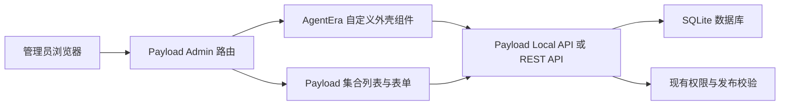

# AgentEra Admin Soybean 风格 UI 设计规格

日期：2026-07-15

状态：设计稿已确认，等待书面规格复核

目标分支：`personal-dev`

## 1. 目标

在不替换 Payload CMS、不重做权限和发布工作流的前提下，将 AgentEra Admin 从 Payload 默认后台升级为接近 Soybean Admin 的中文管理界面。

首个落地版本覆盖：

- 后台通用外壳：品牌侧栏、顶部工具区、面包屑、页签区和内容工作区；
- 官方智能体列表：概览数据、搜索筛选、表格、状态和操作层级；
- 其他集合列表和编辑表单：共享同一套颜色、排版、间距、圆角和控件样式；
- 登录页：沿用 Payload 登录能力，应用 AgentEra 品牌视觉；
- 桌面端优先，并保证窄窗口下可用。

本次不改变业务模型、权限、公开目录 API、发布校验或 SQLite 数据。

## 2. 已确认视觉方向

设计参考为 Soybean Admin 官方演示的轻量后台风格，而不是逐像素复制其产品标识或无关功能。

确认的设计稿：

- 本地预览：`.superpowers/brainstorm/74872-1784098019/content/soybean-agentera-concept-v1.html`
- 页面：官方智能体列表
- 方向：白色侧栏、白色顶部栏、浅灰工作区、蓝紫主色、低阴影白色内容面板

保留的 Soybean 视觉特征：

- 固定左侧导航与清晰的选中态；
- 顶部工具栏、面包屑和页签层级；
- 轻边框、低阴影、8 至 10 像素圆角；
- 蓝紫主色与克制的语义色；
- 紧凑但不拥挤的表格和表单；
- 统一的图标尺寸、标签、分页和按钮体系。

AgentEra 专属内容：

- 品牌名称为“AgentEra 管理系统”；
- 导航为首页、官方智能体、智能体分类、技能目录、媒体资源、管理员和系统设置；
- 官方智能体列表显示头像、名称、稳定标识、分类、技能、状态、发布版本、更新时间和操作；
- 概览显示全部、已发布、草稿和近期新增数量。

## 3. 方案选择

采用“Payload 自定义组件 + 主题样式”，不采用纯 CSS 换肤或独立 Soybean 前端。

理由：

- Payload 继续负责登录、权限、集合路由、表单、草稿、版本和发布；
- 自定义组件补充品牌导航、概览和页面层级；
- SCSS 统一 Payload 原有控件的视觉样式；
- 不引入第二套认证、路由和数据请求层；
- 后续升级 Payload 时，改动集中在少量组件和主题文件。

## 4. 信息架构

### 4.1 通用外壳

页面从左到右、从上到下分为：

1. 固定侧栏，宽屏宽度约 238 像素；
2. 顶部工具栏，高度约 58 像素；
3. 页签栏，高度约 44 像素；
4. 浅灰色主工作区；
5. 工作区内的标题、数据概览和业务面板。

侧栏分组：

- 工作台：首页；
- 内容管理：官方智能体、智能体分类、技能目录、媒体资源；
- 系统管理：管理员、系统设置占位；
- 底部：当前管理员信息和角色。

“系统设置”作为视觉占位，不在本版本新增可访问路由。不可用入口必须有明确禁用态，不能链接到空页面。

### 4.2 官方智能体列表

页面结构：

- 标题和简短说明；
- 主操作“创建智能体”；
- 四个概览项；
- 搜索、状态筛选、列设置和刷新；
- 数据表格；
- 结果数量和分页。

默认表格列：

| 列 | 内容 |
| --- | --- |
| 智能体 | 头像、中文名称、稳定标识 |
| 分类 | 分类名称 |
| 默认技能 | 已绑定技能数量 |
| 状态 | 草稿、已发布或已下架 |
| 发布版本 | `v` 加版本号 |
| 更新于 | 本地化时间 |
| 操作 | 编辑与更多操作 |

列表仍以 Payload 的真实集合查询、搜索、排序、筛选、选择和分页为准，不生成独立的影子数据。

## 5. 设计系统

### 5.1 色彩

| Token | 建议值 | 用途 |
| --- | --- | --- |
| `--ae-bg` | `#f5f7fb` | 工作区背景 |
| `--ae-surface` | `#ffffff` | 侧栏、顶部栏、面板 |
| `--ae-primary` | `#646ced` | 主操作和选中态 |
| `--ae-primary-soft` | `#f0f1ff` | 导航选中背景 |
| `--ae-text` | `#2f3342` | 主文字 |
| `--ae-text-muted` | `#9499a9` | 次要文字 |
| `--ae-border` | `#eef0f5` | 分隔线和边框 |
| `--ae-success` | `#269d65` | 已发布 |
| `--ae-warning` | `#d4931c` | 草稿 |
| `--ae-danger` | `#d95763` | 危险操作和错误 |

页面背景必须保持中性浅灰，不改成米色或暖白。

### 5.2 排版

- 字体栈：`Inter`, `SF Pro Display`, `PingFang SC`, `Microsoft YaHei`, sans-serif；
- 页面标题：22 至 24 像素，粗细 650 至 700；
- 面板标题：15 至 17 像素，粗细 600；
- 正文与表格：12 至 14 像素；
- 辅助文本：10 至 12 像素；
- 控件文字必须显式定义字号和行高，不依赖浏览器默认值。

### 5.3 几何和层次

- 主控件圆角：8 像素；
- 内容面板圆角：10 像素；
- 状态标签圆角：完整胶囊形；
- 内容间距基于 4 像素倍数；
- 面板使用细边框和轻阴影，不使用厚重悬浮卡片；
- 表格继续采用表格容器，不转换成卡片网格。

### 5.4 图标

- 使用统一的线性图标语言；
- 导航图标约 19 像素，工具栏图标约 18 像素；
- 常规描边约 1.8；
- 图标颜色随文字状态变化；
- 不使用 Emoji 代替生产图标。

## 6. 组件与代码边界

### 6.1 Payload 配置接入

通过 Payload 已支持的自定义组件入口接入：

- `admin.components.graphics.Logo`：登录页品牌标识；
- `admin.components.graphics.Icon`：侧栏折叠品牌图标；
- `admin.components.Nav`：AgentEra 分组侧栏；
- `admin.components.header`：顶部工具与页面层级；
- `admin.components.beforeDashboard`：首页欢迎和内容概览；
- `AgentTemplates.admin.components.beforeList`：官方智能体数据概览；
- `AgentTemplates.admin.components.beforeListTable`：列表工具区的补充层。

Payload 默认列表、表单、选择、筛选、分页、草稿、版本和发布控件继续作为行为来源。只有在默认组件无法达到已确认信息层级时，才增加轻量包装组件。

### 6.2 前端组件

建议拆分：

- `AgentEraLogo`：品牌图形和文字；
- `AgentEraNav`：导航分组、选中态、折叠态和管理员摘要；
- `AdminHeader`：面包屑、页签和工具按钮；
- `DashboardOverview`：后台首页概览；
- `AgentListOverview`：官方智能体统计；
- `StatusBadge`：草稿、已发布、已下架状态；
- `adminTheme.scss`：设计令牌及 Payload 组件覆盖。

组件只负责展示和导航，不复制权限判断。导航可见性和操作能力必须继续基于当前管理员及 Payload 权限结果。

## 7. 数据流

概览数据来自当前 Payload 实例，并使用当前登录管理员的访问规则。列表和编辑数据继续由 Payload 管理。概览请求失败时只隐藏或降级概览，不影响管理员进入原始列表和执行核心管理操作。

## 8. 交互和状态

- 导航选中态必须与当前路由一致；
- 侧栏在窄桌面窗口折叠为图标栏，不能覆盖主要内容；
- 搜索、筛选、排序、分页和批量选择沿用 Payload 行为；
- 创建按钮进入 Payload 的官方智能体创建页；
- 编辑操作进入对应文档编辑页；
- 状态颜色必须同时带文字，不只依赖颜色表达；
- 按钮具备 hover、focus-visible、active 和 disabled 状态；
- 动画控制在 120 至 180 毫秒，并遵循 `prefers-reduced-motion`。

## 9. 响应式

### 宽屏：大于等于 1180 像素

- 完整侧栏、顶部工具和四列概览；
- 官方智能体表格显示全部默认列。

### 窄桌面：768 至 1179 像素

- 侧栏折叠为约 72 至 80 像素图标栏；
- 概览调整为两列；
- 表格可隐藏低优先级列或横向滚动；
- 主操作保持可见。

### 小于 768 像素

- 侧栏使用 Payload 已有抽屉行为；
- 顶部工具只保留必要操作；
- 概览为单列或两列；
- 表格允许横向滚动，不能压缩到文字不可读。

后台以 macOS 和 Windows 桌面浏览器为主要目标，移动端只保证可用，不要求与桌面稿相同密度。

## 10. 错误处理与降级

- 概览查询失败：展示非阻塞错误提示，并保留 Payload 原始列表；
- 自定义导航异常：Payload 页面内容仍可通过直接 URL 访问；
- 头像缺失：显示名称首字或稳定标识生成的品牌色占位；
- 分类或技能为空：显示短横线，不伪造数量；
- 无数据：使用中文空状态和创建入口；
- 权限不足：不展示不可执行的主操作，服务端仍由 Payload 拒绝请求。

## 11. 测试策略

实施遵循测试先行。

### 组件测试

- 导航分组和当前路由选中态；
- 状态到标签文字及语义色映射；
- 头像缺失降级；
- 概览数量和查询失败降级；
- 窄窗口折叠状态。

### E2E

- 登录后显示 AgentEra 品牌侧栏；
- 可以从导航进入官方智能体、分类、技能和媒体；
- 官方智能体页显示概览和六条真实草稿；
- 搜索、创建和编辑入口仍可用；
- 内容发布员看不到不允许的管理员操作；
- 桌面和窄桌面视口无主要内容遮挡或横向溢出。

### 回归验证

- `pnpm test:int`；
- `pnpm test:e2e`；
- `pnpm lint`；
- `pnpm build`；
- 浏览器逐页检查登录、首页、官方智能体列表、创建页和编辑页。

## 12. 视觉验收标准

实现必须与已确认设计稿对照检查：

1. 左侧导航宽度、分组、选中态和品牌位置；
2. 顶部栏、面包屑和页签层次；
3. 工作区背景、内容边距和面板容器；
4. 标题、辅助文本、按钮和表格排版；
5. 蓝紫主色、边框、阴影和状态色；
6. 表格列结构、行高、头像、状态和操作；
7. 1180 像素以上与 768 至 1179 像素两档布局；
8. 登录、搜索、创建和编辑核心路径。

完成前需同时检查设计稿截图和最新实现截图，并记录可见差异及修复结果。不能以测试通过代替视觉一致性验收。

## 13. 非目标

本版本不包含：

- 独立 Soybean Vue 前端；
- 用户注册和普通用户后台；
- 多租户切换；
- 统计分析、图表和运营报表；
- 系统设置业务功能；
- 桌面端 Studio UI 改造；
- 官方智能体数据模型或发布协议调整。

这些能力后续可以在当前设计系统上增量扩展。
