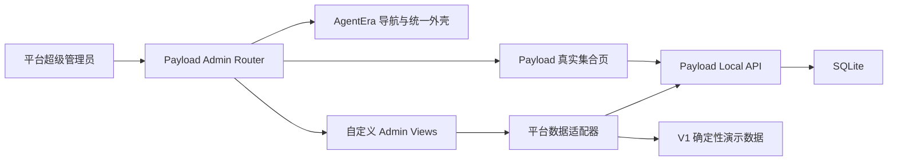

# AgentEra 平台总后台 V1 设计规格

日期：2026-07-15

状态：视觉方案已确认，等待书面规格复核

目标分支：`personal-dev`

## 1. 产品定位

AgentEra Admin 是面向 AgentEra 平台运营方的系统总后台，不是单独的智能体内容管理器，也不是租户自助后台。

V1 仅允许 AgentEra 平台超级管理员和既有内容发布员登录。租户管理员、企业成员和桌面端个人用户不进入本后台。租户自助管理能力只作为后续独立产品边界预留，本版本不提供入口。

本版本目标：

- 将当前官方智能体后台扩展为完整的平台运营后台外壳；
- 以已确认的 Soybean 风格平台总览稿为接近 1:1 的视觉实现基准；
- 保留 Payload 对真实集合、认证、权限、草稿、版本和发布流程的管理；
- 为尚未建立后端的数据域提供可访问、可浏览、明确标注为“演示”的页面；
- 让演示模块未来能够逐项替换为真实接口，而不重做导航和页面骨架。

## 2. 已确认的视觉基准

确认稿：

- HTML：`.superpowers/brainstorm/82138-1784102199/content/agentera-platform-admin-v1.html`
- 用户确认截图：`/var/folders/d8/tb_9ybdj5xzg_l5451f5209c0000gn/T/codex-clipboard-9392e87e-35d0-4e1a-a8b0-0dbd4f42e758.png`
- 视觉方向：白色固定侧栏、白色顶部栏和页签栏、中性浅灰工作区、蓝紫主色、低阴影白色面板、紧凑的数据后台密度。
- 品牌图标：用户提供的 `0040d4470c8d63919412e23b73eecaee.png` 处理后的透明版本。

还原要求：

- 宽屏侧栏约 238 至 248 像素；
- 顶部栏约 58 像素，页签栏约 42 至 44 像素；
- 首页包含标题说明、演示数据说明、四项指标、平台趋势、服务健康、近期租户和最近运营动态；
- 颜色、文字层级、间距、圆角、轻边框、阴影、图标尺寸、状态标签与确认稿保持一致；
- 1440 像素及以上宽屏应与确认稿保持近似相同的首屏构图；
- 不能把表格改成卡片网格，不能增加确认稿中不存在的大面积装饰或营销内容。

## 3. 方案选择

采用方案 B：`Payload 真实业务页 + 自定义平台页面 + 统一 AgentEra 外壳`。

不采用的方案：

- 全部建立为 Payload 集合：占位功能会迫使项目过早固化用户、租户、计费和运行任务的数据模型；
- 独立 Soybean SPA：会重复建设认证、权限、路由和数据请求层，当前阶段成本过高。

方案 B 的职责边界：

- Payload 集合页负责真实数据的增删改查、权限和发布；
- Payload 自定义 Admin View 负责总览和演示模块；
- AgentEra 自定义导航负责统一信息架构和选中态；
- 演示数据只存在于只读展示配置中，不写入 SQLite，不通过公开 API 暴露；
- 将来接入真实服务时，通过页面级数据适配器替换演示数据，不改变路由和视觉组件。

## 4. 信息架构与路由

### 4.1 工作台

| 页面 | 路由 | 数据状态 |
| --- | --- | --- |
| 平台总览 | `/admin` | 官方智能体数量为真实数据，其他指标明确标为演示 |

### 4.2 用户与租户

| 页面 | 路由 | V1 内容 |
| --- | --- | --- |
| 用户管理 | `/admin/platform-users` | 演示统计、搜索筛选、用户表格 |
| 租户管理 | `/admin/tenants` | 演示统计、套餐与租户状态表格 |
| 账号审核 | `/admin/account-reviews` | 演示待审核列表和审核状态 |

### 4.3 智能体生态

| 页面 | 路由 | 数据状态 |
| --- | --- | --- |
| 官方智能体 | `/admin/collections/agent-templates` | Payload 真实集合 |
| 智能体分类 | `/admin/collections/expert-categories` | Payload 真实集合 |
| 技能目录 | `/admin/collections/skill-catalog` | Payload 真实集合 |
| 媒体资源 | `/admin/collections/media` | Payload 真实集合 |

### 4.4 AI 与运行

| 页面 | 路由 | V1 内容 |
| --- | --- | --- |
| 模型与服务 | `/admin/model-services` | 演示提供商、模型状态和调用统计 |
| Runtime 版本 | `/admin/runtime-versions` | 演示 macOS/Windows 版本和发布通道 |
| 任务运行 | `/admin/task-runs` | 演示任务状态、耗时和来源租户 |

### 4.5 商业与运营

| 页面 | 路由 | V1 内容 |
| --- | --- | --- |
| 套餐管理 | `/admin/plans` | 演示套餐和权益摘要 |
| 订单中心 | `/admin/orders` | 演示订单状态和金额列表，不提供支付动作 |
| 公告运营 | `/admin/announcements` | 演示公告列表和发布状态 |

### 4.6 系统管理

| 页面 | 路由 | 数据状态 |
| --- | --- | --- |
| 管理员 | `/admin/collections/admins` | Payload 真实集合 |
| 审计日志 | `/admin/audit-logs` | 演示操作日志，只读 |
| 系统设置 | `/admin/system-settings` | 演示配置分组，只读或禁用 |

V1 不建立“权限角色”独立页面。现有 `super-admin` 与 `publisher` 权限继续由 Payload 管理，避免在没有租户权限模型前做一套虚假的 RBAC 编辑器。

## 5. 平台总览页面

### 5.1 标题与数据声明

- 标题：“AgentEra 平台总览”；
- 说明：“统一查看平台用户、租户、智能体生态、Runtime 和服务运行状态”；
- 右侧持续显示前置版数据声明：“标有‘演示’的指标暂未连接生产数据”。

### 5.2 四项指标

1. 注册用户：演示数据；
2. 活跃租户：演示数据；
3. 官方智能体：通过 Payload Local API 实时计数；
4. 今日运行任务：演示数据。

每张卡片必须在标签中直接显示“真实”或“演示”，不能只通过颜色暗示。

### 5.3 平台活跃趋势

- V1 使用确定性的七天演示序列；
- 同时显示“活跃用户”和“运行任务”两条曲线；
- “近 7 天”选中，“近 30 天”作为无数据切换占位，点击后需保持页面稳定并显示演示说明；
- 图表使用轻量原生 SVG，不引入大型图表依赖。

### 5.4 服务健康状态

- 平台数据库：通过首页真实查询成功与否显示“正常”或“异常”；
- 公开目录 API：使用当前 Payload 目录能力的可用状态；
- 模型网关：演示状态；
- Hermes Runtime：演示“联调中”状态。

### 5.5 近期租户与运营动态

- 近期租户为三条确定性的演示数据；
- 运营动态同时包含一条真实的官方智能体目录摘要和演示事件；
- 每个面板标题旁必须显示数据性质，真实与演示混合时注明“真实与演示事件分开展示”。

## 6. 演示模块页面模板

演示页面不是空白占位。每个页面至少包含：

- 页面标题、用途说明和“演示数据”标识；
- 2 至 4 个摘要指标；
- 搜索或状态筛选的视觉控件；
- 与该业务域匹配的只读表格；
- 页面底部的数据来源说明；
- 对创建、审核、发布、退款、删除和修改系统配置等会产生业务影响的按钮使用禁用态，并显示“接入后端后开放”。

演示页不允许：

- 把点击结果写入 Payload 或 SQLite；
- 调用真实外部服务；
- 伪造成功提示；
- 展示可能被理解为真实营收、真实客户或真实系统告警的数据而不做标注。

## 7. 组件和代码边界

建议组件：

- `AgentEraLogo`：使用真实品牌图片的完整与紧凑形态；
- `AgentEraNav`：平台级分组导航、选中态和管理员摘要；
- `PlatformDashboard`：平台总览服务端容器；
- `PlatformMetricCard`：真实/演示指标卡；
- `PlatformTrendChart`：轻量 SVG 趋势图；
- `ServiceHealthList`：真实与演示服务状态；
- `RecentTenantTable`：演示租户表格；
- `OperationsFeed`：真实与演示运营事件；
- `PlatformModuleView`：演示模块的共享页面骨架；
- `platformModules.ts`：演示模块路由、文案、指标、筛选项和表格数据配置；
- `platformData.ts`：真实 Payload 查询与演示数据适配器。

单个组件只负责一个区域。平台模块的配置与 UI 渲染分离，避免为十个演示页面复制十份大组件。

## 8. 数据流

真实查询失败时：

- 对应指标显示“—”和非阻塞错误说明；
- 演示模块仍可浏览；
- 不用演示值冒充失败的真实值；
- Payload 原生集合路由继续可直接访问。

## 9. 访问控制

- 未登录用户仍由 Payload 重定向到登录页；
- `super-admin` 可访问全部导航和页面；
- `publisher` 保留现有官方智能体、分类、技能和媒体权限；
- 平台运营演示页面对 `publisher` 隐藏并由服务端拒绝或重定向，避免只在导航层隐藏；
- V1 不修改现有集合的服务端访问规则。

## 10. 响应式

### 大于等于 1180 像素

- 完整 238 至 248 像素侧栏；
- 四列指标卡；
- 趋势图与服务状态双列；
- 近期租户与运营动态双列。

### 768 至 1179 像素

- 侧栏折叠为约 78 像素图标栏；
- 指标卡两列；
- 图表、服务状态和底部面板改为单列；
- 所有导航入口保留可访问名称或 Tooltip。

### 小于 768 像素

- 使用 Payload 既有抽屉导航行为；
- 指标卡单列或两列；
- 表格横向滚动；
- 主要内容不得被固定导航覆盖。

## 11. 测试策略

实施遵循 RED、GREEN、REFACTOR。

### 集成测试

- 平台模块配置包含全部确认路由且路由唯一；
- 真实与演示数据标签映射正确；
- `publisher` 与 `super-admin` 可见模块不同；
- 官方智能体真实计数失败时不回退为演示数字；
- 演示模块数据结构可被共享页面模板渲染。

### E2E

- 登录后首页显示“AgentEra 平台总览”；
- 四项指标、趋势图、服务状态、近期租户和运营动态可见；
- 官方智能体卡显示 Payload 真实数量；
- 导航包含六个确认分组；
- 真实集合入口继续打开 Payload 列表；
- 每个演示入口打开对应页面并显示“演示数据”；
- 演示页面中的业务写操作不可执行；
- 1440 宽屏和 900 窄桌面无内容遮挡和意外横向滚动；
- 新品牌图标在登录页、完整侧栏、折叠侧栏和浏览器 favicon 中可见。

### 完成验证

- `pnpm test:int`；
- `pnpm test:e2e`；
- `pnpm lint`；
- `pnpm build`；
- 在 1440×900 视口捕获最终实现截图；
- 使用图像检查同时打开确认设计稿和最终截图，对导航、首屏构图、排版、颜色、图标、间距、表格和响应式逐项比较。

## 12. V1 非目标

- 租户自助后台；
- 用户注册、登录和租户邀请的真实业务实现；
- 真实模型网关、任务遥测和 Runtime 发布服务；
- 支付、退款、发票和真实套餐计费；
- 公告真实推送；
- 完整审计事件采集；
- 可编辑的系统配置；
- 新建租户、审核账号或修改用户状态等真实写操作。

这些能力在 V1 中只保留清晰页面边界和演示数据，后续按业务优先级逐项替换。
