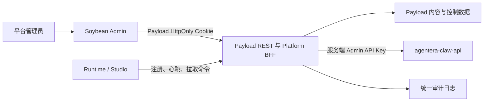

# AgentEra 全系统平台总后台设计规格

日期：2026-07-16

状态：设计已批准，分阶段实施计划已编写

目标分支：`personal-dev`

## 1. 文档地位

本规格定义 AgentEra 面向平台管理员的正式系统总后台，并取代下列文档中与本规格冲突的产品和架构决定：

- `2026-07-15-agentera-platform-admin-v1-design.md` 中的 Payload 正式前端、演示页面和演示数据方案；
- `2026-07-16-agentera-soybean-payload-admin-architecture-design.md` 中“不增加 BFF”和“不接入外部业务后端”的阶段性限制。

仍然有效的既有决定包括：

- 正式后台使用 Soybean Admin；
- Payload 继续负责管理员认证和现有内容数据；
- `admin-web` 保持仓库内独立 Vue/Vite 工程；
- Payload 原生 Admin 只作为内部应急入口，不继续承担正式平台页面；
- 路线简单和长期可维护性优先于短期页面数量。

## 2. 背景与代码现实

当前 Soybean 后台只有平台总览和智能体分类两个页面。聚合工作区中真实存在的管理能力远多于当前后台：

- `agentera-admin`：Payload 管理员、官方智能体、分类、技能、媒体、草稿、发布和版本；
- `agentera-claw-api`：用户、API Key、上游账号、渠道、路由组、代理、订阅、订单、支付、兑换码、优惠码、返利、公告、用量、运维、风控、备份和系统设置；
- `agentera-claw-runtime`：Agent 运行、模型与工具、技能、插件、会话、网关渠道、Cron、API Server、健康检查和桌面运行时；
- 本地 Studio 仓库 `hermes-studio`：桌面/Web 控制台、用户与 Profile、设备、Runtime 版本、任务、工作流、Coding Agent、渠道、日志和本地 SQLite 数据。

这些能力分属内容、交易、资源和本地运行四个数据域。总后台不能把它们重新建成一套 Payload 业务数据库，也不能让 Soybean 在浏览器里分别持有四套管理密钥。

## 3. 核心决定

采用“Soybean 统一后台、Payload 统一管理员身份和 BFF、各后端保留业务所有权”的方案。



约束：

1. 正式平台后台只有 Soybean 一个入口。
2. 浏览器只持有 Payload 管理员会话。
3. 每类业务只有一个真实数据源。
4. Payload BFF 聚合、鉴权、脱敏和审计，不复制外部业务表。
5. Runtime/Studio 主动连接平台，平台不要求用户设备开放公网端口。
6. 未接入的数据不使用演示值填充，未完成模块在交付前不进入正式菜单。

## 4. 产品边界

本后台服务于 AgentEra 平台运营、内容、财务、运维和审计人员，不是用户端、租户自助后台或本地 Studio 的替代品。

平台后台可管理：

- 平台用户、额度、订阅和账号状态；
- 官方智能体、技能、插件、媒体和宠物资源；
- 模型渠道、上游账号、代理、路由和价格；
- Runtime/Studio 实例、版本、健康、任务元数据和运维命令；
- 套餐、订单、支付、营销、公告；
- 流量、用量、错误、告警、风控、备份、审计和系统策略。

默认不可读取：

- 用户聊天、推理和提示词正文；
- 用户记忆正文；
- 用户文件、工作区补丁和终端输入输出；
- 用户 Profile 的原始配置；
- API Key、OAuth Token、Bot Token、代理密码等原始凭证。

后台只展示完成运营和诊断所需的数量、状态、时间、Token、费用、错误码、脱敏标识和结构化事件。

## 5. 数据所有权

### 5.1 Payload

Payload 是平台管理面，不是全业务数据库。它负责：

- 平台管理员和固定角色；
- 官方智能体、分类、技能和媒体；
- 插件目录和宠物资源目录；
- Runtime 实例注册、版本发布、命令和脱敏事件；
- 外部服务连接配置状态；
- 平台后台审计日志；
- `/api/platform/v1/*` 管理员 BFF；
- `/api/control/v1/*` Runtime/Studio 控制入口。

### 5.2 `agentera-claw-api`

该服务继续拥有：

- 用户、认证身份、用户属性、额度和 API Key；
- 模型渠道、上游账号、路由组、代理和渠道监控；
- 套餐、订阅、订单、支付渠道、兑换码和优惠码；
- 邀请返利和公告；
- 使用记录、流量、错误、告警、风控、备份和系统配置；
- 新增的最小组织/租户、成员关系和账号审核模型。

### 5.3 Runtime/Studio

实例自身继续拥有：

- 会话、消息、记忆、文件和本地 Profile；
- 本地任务、工作流、Cron、Coding Agent 和渠道配置；
- 本地凭证、设备状态、日志和运行时配置。

平台只持久化这些对象的管理元数据、健康摘要、脱敏事件和命令结果。

## 6. 信息架构

### 6.1 平台总览

- 平台总览：用户、收入、Token、请求量、在线实例、任务、错误率、告警；
- 运营趋势：用户、用量、费用、模型和渠道趋势；
- 待办中心：账号审核、失败订单、离线实例、失败任务和未处理告警；
- 服务状态：Payload、API、Runtime/Studio 控制面、数据库和缓存状态。

### 6.2 用户与权限

- 平台用户：创建、启停、额度、并发、路由组和平台配额；
- 用户详情：API Key、用量、余额、订阅、属性和 Runtime 实例；
- 账号审核：待审核身份、认证来源、通过、拒绝和原因；
- 组织与租户：组织、成员、所有者、套餐、实例和资源统计；
- 管理员：创建、角色、启停、重置密码和登录记录；
- 用户属性：定义、排序、允许值和批量设置。

默认使用“禁用用户”，永久删除只允许超级管理员执行。

### 6.3 智能体生态

- 官方智能体：草稿、预览、发布、下架、版本历史和关联资源；
- 智能体分类：搜索、增删改、排序和启停；
- 技能目录：元数据、版本、兼容范围和发布状态；
- 插件目录：元数据、安装方式、版本、兼容性和风险等级；
- 媒体资源：图片、头像、附件和引用情况；
- 宠物资源：精灵图、清单、预览、版本和适用客户端；
- 发布中心：待发布内容、批量发布、下架和版本记录。

技能、插件和宠物目录只保存发布索引，不复制 Runtime 仓库完整源码或本地安装状态。

### 6.4 AI 资源

- 模型渠道：渠道、默认价格和模型同步；
- 上游账号：OAuth、测试、刷新、配额、模型和调度状态；
- 路由组：账号绑定、倍率、RPM、容量和 API Key；
- 代理节点：连通测试、质量、关联账号和统计；
- 渠道监控：监控任务、模板、立即检测和历史；
- 定时测试：账号测试计划和结果；
- 高级网络：TLS 指纹和错误透传规则。

### 6.5 Runtime 与 Studio

- 实例列表：在线、租户、设备、系统、版本、最后心跳、任务和错误；
- 实例详情：健康、能力、资源、渠道、任务摘要和脱敏事件；
- 版本中心：Runtime、Studio、Desktop 版本和发布通道；
- 发布与升级：灰度、升级进度、失败重试、暂停和回滚；
- 设备管理：Desktop、局域网设备、MCU、绑定和最后在线；
- 渠道状态：各消息平台的配置状态和连接错误，不显示 Token；
- 兼容性策略：最低版本、禁用版本和兼容矩阵。

允许的实例命令包括健康检查、维护状态、重启、升级、回滚和请求脱敏诊断。

### 6.6 任务与自动化

- 运行中心：状态、来源、模型、Token、耗时、费用、错误和实例；
- 运行详情：生命周期事件、工具数量、审批状态和错误摘要；
- 工作流：名称、版本、节点数、运行状态和失败节点；
- Cron：计划、下次运行、暂停、恢复、立即运行和历史；
- Coding Agent：类型、工作区标识、状态、耗时和变更统计；
- 审批队列：只处理平台创建任务的工具审批；
- 失败任务：失败原因、重试、取消、实例和请求编号。

用户本地任务仍由用户本人审批。平台管理员不能查看其提示词、回复、补丁或终端输出。

### 6.7 商业与运营

- 商业总览：收入、订单、订阅、退款和套餐分布；
- 套餐管理：价格、额度、周期和状态；
- 订阅管理：分配、延期、重置额度、撤销和恢复；
- 订单中心：详情、取消、重试履约、退款和退款查询；
- 支付渠道：服务商配置、启停和连通状态；
- 营销工具：兑换码、优惠码、生成、导出、失效和记录；
- 邀请返利：邀请、返利、转账和比例；
- 公告运营：创建、编辑、发布、删除和阅读状态。

公告只保存在 `agentera-claw-api`，Payload BFF 只提供管理入口、权限和审计。

### 6.8 运维与安全

- 运维总览：QPS、TPS、并发、延迟、错误率和账号可用性；
- 实时流量：请求、模型、渠道、成功率和趋势；
- 请求诊断：请求元数据、上游错误链、耗时和处理状态；
- 错误中心：请求、上游和系统错误；
- 告警中心：规则、事件、静默、通知和阈值；
- 风控中心：审核配置、状态、日志、解封和风险哈希；
- 使用记录：用户、API Key、模型、Token、费用和清理任务；
- 系统日志：脱敏日志、采集健康和清理；
- 审计日志：登录、修改、发布、退款、升级、导出和敏感操作；
- 合规状态：部署合规确认。

### 6.9 数据与系统

- 备份恢复：S3、计划、创建、下载、删除和恢复；
- 数据管理：数据源、S3 Profile、备份任务和 Agent 健康；
- 数据清理：用量清理、日志保留和取消任务；
- 平台设置：品牌、站点、注册、默认配额和功能开关；
- 认证设置：OAuth、OIDC、微信、钉钉和邮件认证；
- 邮件设置：SMTP、测试、模板和恢复官方模板；
- 网关策略：429/529 冷却、流超时、整流器和 Beta 策略；
- 搜索策略：Web Search 模拟、测试和用量重置；
- Runtime 策略：心跳、离线判定、最低版本、升级窗口和日志级别；
- 集成配置：业务 API 地址、连接状态和 Runtime 注册策略；
- 服务版本：API 版本、检查更新、升级、回滚和重启。

## 7. 明确不建设的页面

以下能力属于用户端或本地 Studio，不进入平台总后台：

- 聊天页面；
- 记忆浏览器；
- 文件管理器；
- Web 终端；
- 用户 Profile 编辑；
- 用户个人模型密钥管理；
- TTS/STT 个人设置；
- 用户 Kanban 内容。

总后台只显示这些能力的启用状态、数量、健康和费用摘要。

## 8. 管理员角色与权限

第一版使用五个固定角色，不建设动态角色编辑器：

| 角色       | 代码值             | 职责                                      |
| ---------- | ------------------ | ----------------------------------------- |
| 超级管理员 | `super_admin`      | 全部功能和高风险操作                      |
| 运营管理员 | `operations_admin` | 用户、额度、套餐、Runtime、任务和日常运维 |
| 内容发布员 | `publisher`        | 智能体、分类、技能、插件、媒体和宠物      |
| 财务管理员 | `finance_admin`    | 套餐、订阅、订单、退款、支付和营销        |
| 审计观察员 | `auditor`          | 指标、错误、告警、安全和审计只读          |

权限以固定 capability 字符串表达，例如：

- `content:agents:publish`
- `users:balance:update`
- `runtime:instance:restart`
- `billing:order:refund`
- `system:backup:restore`

角色到 capability 的映射保存在服务端代码中。Soybean 可以据此隐藏按钮和菜单，但 Payload BFF 必须再次验证，不能依赖前端守卫。

## 9. 操作风险等级

普通操作包括查询、脱敏导出和内容编辑。

重要操作包括修改额度、启停任务、修改套餐、模型价格、渠道配置和内容发布。重要操作需要确认并写审计日志。

高风险操作包括：

- 永久删除用户；
- 退款；
- Runtime 批量升级、回滚和重启；
- 数据库恢复；
- 修改支付渠道；
- 重新生成系统管理密钥。

高风险操作要求超级管理员重新验证密码，并记录操作前后差异、操作者、IP、User-Agent、时间、目标和请求编号。

## 10. 敏感数据和紧急授权

所有角色默认只看到掩码凭证，例如 `sk-****7A9F`。

紧急授权默认关闭。确有支持需求后才启用，并满足：

- 仅超级管理员；
- 重新验证密码并填写原因；
- 只授权一个用户或一个会话范围；
- 最长 15 分钟；
- 所有查看逐条审计；
- 原始密钥和终端内容始终不开放。

V1 不实现敏感正文查看接口，因此即使管理员绕过前端也无法读取这些数据。

## 11. Soybean 页面模式

后台优先复用三种模式：

1. 列表页：筛选、表格、分页和批量操作；
2. 详情抽屉：在当前页面查看关联数据；
3. 编辑弹窗：处理简单增删改，复杂配置才使用独立页面。

同类功能通过标签页合并。例如模型渠道与价格、监控任务与模板、兑换码与优惠码，不为每个小接口增加侧栏项。

所有页面必须支持：

- 加载状态；
- 空数据；
- 权限不足；
- 后端未配置；
- 后端不可用；
- 数据加载失败。

失败时不回退到演示数据。

## 12. Payload BFF

浏览器访问的统一资源接口位于 `/api/platform/v1/*`。页面不直接访问其他服务。

BFF 请求顺序：

1. 验证 Payload 管理员 Cookie；
2. 验证 capability；
3. 校验并清理输入；
4. 调用对应服务适配器；
5. 进行字段映射和脱敏；
6. 对修改操作写入审计；
7. 返回统一响应和请求编号。

官方智能体、分类、技能、媒体、插件和宠物等 Payload 自有集合继续使用标准 Payload REST API，不为它们重复包装一层代理。它们的服务端权限仍由 Collection `access` 控制，创建、修改、删除和发布审计通过 Payload hooks 写入同一个 `audit-logs` 集合。登录、退出和密码变更同样由认证 hooks 审计。因此“统一审计”不要求所有请求都改成 `/api/platform/v1/*`。

高风险操作重新验证由 BFF 调用服务端认证逻辑完成，只返回短时、单用途的确认结果；Soybean 不保存或转发管理员明文密码到外部业务服务。

`agentera-claw-api` 通过以下服务端环境变量连接：

```text
AGENTERA_API_URL
AGENTERA_API_ADMIN_KEY
```

Admin API Key 不进入 Soybean 构建产物、浏览器存储或网络响应。

适配器规则：

- GET 请求可以在连接错误或网关错误时有限重试；
- 修改请求默认不自动重试；
- 退款、创建订单和恢复操作必须使用幂等键；
- 上游分页、排序、筛选和错误在适配器中统一；
- 上游请求编号与 BFF 请求编号关联；
- 上游响应中的凭证字段必须先在服务端删除或掩码。

成功响应：

```json
{
  "data": {},
  "meta": {},
  "requestId": "req_xxx"
}
```

失败响应：

```json
{
  "error": {
    "code": "UPSTREAM_UNAVAILABLE",
    "message": "模型服务暂时不可用"
  },
  "requestId": "req_xxx"
}
```

## 13. Runtime/Studio 控制协议

Runtime/Studio 处在用户设备或内网时，由实例主动连接平台。

### 13.1 注册

```text
POST /api/control/v1/enroll
```

平台管理员先创建一次性注册码。实例提交注册码、类型、设备标识、版本、操作系统和能力列表，获得 `instanceId` 与设备密钥。注册码只保存哈希并在成功注册后失效；设备密钥只返回一次并以哈希形式保存。

### 13.2 心跳

```text
POST /api/control/v1/heartbeat
```

每 30 至 60 秒上报：

- Runtime、Studio 和 Desktop 版本；
- 操作系统、架构、启动时间和在线状态；
- Profile、任务、工作流和 Cron 数量；
- Token、费用和错误数量；
- 网关渠道配置状态；
- 实例支持的管理能力。

心跳不上传聊天、记忆、文件、终端、提示词、回复或原始凭证。

### 13.3 命令

心跳响应可以携带待执行命令：

- 健康检查和脱敏诊断；
- 进入或退出维护；
- Runtime 重启、升级和回滚；
- 暂停、恢复、取消任务；
- 立即运行 Cron。

命令状态：

```text
queued -> claimed -> running -> succeeded | failed | expired
```

每个命令具有唯一 ID、幂等键、过期时间、创建人和所需 capability。实例不能领取不在自身能力列表内的命令。

### 13.4 命令结果

```text
POST /api/control/v1/commands/:id/result
```

结果只包含状态、时间、错误码和脱敏摘要。大体积诊断文件使用短期上传地址，保存前再次脱敏，并受保留期限控制。

### 13.5 兼容现有接口

Runtime 已有 `/health/detailed`、`/v1/capabilities`、`/v1/runs`、`/api/jobs` 等本地接口；Studio 已有健康、设备、Runtime 版本、任务、工作流和日志接口。

控制客户端优先复用这些能力进行本地采集和执行，只新增中央注册、心跳和命令适配层，不重写现有运行逻辑。

## 14. 最小新增数据模型

Payload 新增：

- `plugin-catalog`：平台发布的插件元数据；
- `pet-assets`：宠物精灵图、清单、版本和发布信息；
- `runtime-instances`：注册、归属、版本、能力、状态、最后心跳和设备密钥哈希；
- `runtime-releases`：版本、通道、兼容范围、制品信息和发布状态；
- `runtime-commands`：命令、幂等键、状态、结果摘要和过期时间；
- `runtime-events`：脱敏结构化事件、严重级别和保留期限；
- `integration-settings`：服务类型、地址、启用状态和健康摘要；
- `audit-logs`：追加式后台操作审计。

`agentera-claw-api` 新增：

- `tenants`：组织/租户主体；
- `tenant_memberships`：用户、角色和状态；
- 用户认证审核状态与最小审核接口。

跨服务关联使用稳定外部 ID，不建立跨数据库外键。Payload 的 Runtime 实例可以保存 `tenantId`，但租户详情始终从 API 查询。

## 15. 审计模型

审计日志至少包含：

- 操作者 ID、邮箱和角色；
- capability、动作和资源类型；
- 资源 ID 和脱敏名称；
- BFF 请求编号和上游请求编号；
- 成功、失败和错误码；
- IP、User-Agent 和时间；
- 脱敏后的 before/after 差异；
- 高风险操作的重新验证记录和填写原因。

审计集合只允许追加。普通管理员不能修改或删除记录；保留和归档由系统策略执行。

## 16. 开发与生产路由

本地开发：

- Payload：`http://localhost:3100`
- Soybean：`http://localhost:9527`
- Vite 将 `/api` 代理到 Payload；
- API 服务继续使用独立地址，由 Payload BFF 连接。

生产环境通过反向代理保持同源：

```text
/admin/* -> Soybean 静态后台
/api/*   -> Payload REST、BFF 和控制协议
```

Payload 原生 Admin 不占用正式 `/admin`，只允许通过内部网络或服务直连地址应急访问，也可以在生产环境完全关闭外部路由。

不使用 iframe、微前端或浏览器跨服务登录。

## 17. 分阶段实施

### 阶段 1：Soybean 正式后台基础

- 完成菜单、路由、页面基础组件、固定角色、BFF 骨架和 Payload 审计 hooks；
- 完成智能体、分类、技能、媒体和管理员；
- 新增插件目录、宠物资源和发布中心；
- 平台总览只展示真实 Payload 数据和服务连接状态。

验收：全部内容管理可以在 Soybean 中完成。

### 阶段 2：用户与 AI 资源

- 建立 API 服务端适配器；
- 接入用户、属性、额度、API Key 和订阅详情；
- 接入渠道、账号、路由组、代理、监控、定时测试和高级网络。

验收：API 核心资源可以在 Soybean 中真实管理，凭证全部脱敏。

### 阶段 3：商业运营与 API 运维

- 接入套餐、订阅、订单、支付、营销、返利和公告；
- 接入用量、实时流量、请求诊断、错误、告警、风控、日志、备份和系统设置。

验收：API 原正式后台能力全部进入 Soybean，不使用 iframe。

### 阶段 4：Runtime/Studio 控制平面

- 建立 Payload 控制数据和端点；
- Runtime/Studio 增加最小控制客户端；
- 完成实例、版本、升级、设备、渠道、任务、工作流、Cron 和 Coding Agent 页面。

验收：内网实例无需开放端口即可显示在线状态并安全执行管理命令。

### 阶段 5：跨系统聚合和缺失模型

- 完成平台总览和待办中心；
- 增加租户和账号审核；
- 关联用户、租户、订阅和 Runtime；
- 完成最低版本、兼容矩阵和灰度策略。

验收：从用户或租户可以追踪其套餐、用量、实例和异常，但看不到敏感正文。

### 阶段 6：收尾和安全加固

- 高风险重新验证；
- 审计查询、导出和完整性验证；
- 密钥、日志、错误和诊断包安全检查；
- 性能和大分页测试；
- 删除旧 Payload 演示页面和演示数据；
- 完成部署、运维和开发文档。

验收：没有演示功能、空入口、双数据源和未审计修改。

## 18. 迁移策略

- 开发阶段只有完成并验收的模块进入正式 Soybean 菜单；
- Payload 原生集合页面在对应 Soybean 页面完成前继续作为内部维护兜底；
- 旧 Payload 自定义演示视图不继续扩展，最终阶段删除；
- API 现有 Vue 管理后台保持可用，直到对应 Soybean 模块通过验收；
- 可以复用 API 前端的 TypeScript 请求定义和字段知识，但不复制旧页面组件；
- Runtime/Studio 控制客户端以独立小模块接入，不侵入 Agent 主循环。

## 19. 简单路线约束

本项目明确不采用：

- iframe 嵌入旧后台；
- 微前端；
- GraphQL 聚合层；
- 第一版消息队列；
- 动态 RBAC 设计器；
- 跨服务共享数据库；
- 把 API 业务表复制成 Payload Collection；
- 一次性重写四个仓库业务逻辑。

只有在真实容量或可靠性证据证明 HTTPS 心跳轮询不足时，才将 Runtime 控制通道升级为长连接或消息队列。

## 20. 测试与验证

### 20.1 单元测试

- capability 与角色映射；
- BFF 输入校验、错误映射和凭证脱敏；
- API 适配器分页、筛选和字段转换；
- Runtime 命令状态机、过期和幂等；
- 审计 before/after 脱敏；
- Soybean service 和页面状态映射。

### 20.2 契约测试

- Payload BFF 对 `agentera-claw-api` 的真实响应形状；
- Runtime/Studio 注册、心跳、命令和结果；
- 旧版本实例缺少新 capability 时的兼容行为；
- 上游超时、未配置、不可用和部分失败。

### 20.3 E2E

- 管理员登录、会话恢复和退出；
- 各角色菜单和操作权限；
- 内容创建、编辑、发布和下架；
- 用户额度、渠道配置、订单退款等代表性业务动作；
- Runtime 注册、离线、命令、超时和失败；
- 高风险重新验证；
- 浏览器请求中不存在服务端管理密钥；
- 空数据、403、上游离线和错误页面；
- 手机和桌面宽度无整体横向溢出。

### 20.4 仓库验证

每个修改阶段必须执行对应仓库的测试、类型检查、lint 和生产构建。测试数据库与开发数据隔离，不得对真实订单、用户、实例或支付服务执行破坏性测试。

## 21. 成功标准

- 正式平台管理页面全部使用 Soybean；
- 平台管理员只登录一次；
- 现有真实后端能力均可从 Soybean 管理；
- 每个业务域只有一个真实数据源；
- 所有修改都有服务端权限校验和审计；
- 所有凭证和敏感内容遵守默认不可见边界；
- Runtime/Studio 在 NAT 后也能被平台观察和管理；
- 后端未配置或不可用时明确报错，不展示演示数据；
- Payload 原生前端不再承载正式产品页面；
- 后续增加页面只需复用统一列表、抽屉、弹窗和服务适配器模式。

## 22. 规格复核清单

- [x] 用户确认本文准确反映已批准的五部分设计；
- [x] 实施计划按六个阶段拆分并包含逐任务验证；
- [x] 每个页面在计划中标出真实数据源和所需 capability；
- [x] Runtime 控制协议先实现最小注册、心跳和命令，不提前引入复杂基础设施；
- [ ] 任何旧演示页面在真实替代完成前不得进入正式 Soybean 菜单。
