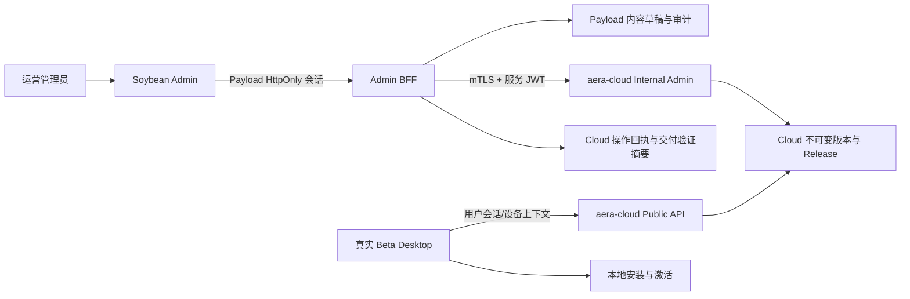

# 内容目录 → Cloud → Desktop 消费闭环设计

日期：2026-08-12  
状态：设计已确认，待实现计划  
目标仓库：`aera-admin`（必要时以窄范围合同变更同步 `aera-cloud` 与 Desktop `aera`）

## 1. 目标与边界

本规格把后台中“官方智能体、智能体分类、技能目录、官方插件、发布中心”从 Admin 本地 Payload CRUD，升级为可被真实 Cloud 和 Desktop 消费的内容交付链路。

目标闭环为：

```text
Admin 内容草稿 → Cloud definition/draft → Cloud 校验 → 审核 → 不可变 Release
    → Desktop 官方目录读取 → 签名/兼容性验证 → 安装/激活 → 后台交付回执
```

本阶段不做：

- Aera API 用户、账务、运营等上游接入；该工作保持独立批次；
- Desktop 重启、升级、配置下发；
- 用 Payload `_status=published` 冒充 Cloud 发布；
- 把官方 Agent 的角色提示词、专有知识、内部 skill ID 或凭证下发给浏览器；
- 在 Desktop 没有真实消费协议时宣称官方插件“已发布可用”。

现有 Cloud 用户、Desktop 在线/离线、健康检查、管理员和审计链路不回退。

## 2. 现状与事实源

### 2.1 Admin 内容集合

Payload 当前集合及职责：

- `agent-templates`：官方智能体编辑草稿、稳定标识、分类、技能关系、兼容版本和发布说明；
- `expert-categories`：分类稳定标识、名称、排序和启用状态；
- `skill-catalog`：技能元数据、`runtimeSkillId`、最低 Runtime 版本和启用状态；
- `plugin-catalog`：插件元数据、制品 URL、SHA-256、平台兼容性和风险等级；
- `media`：后台媒体引用；
- `audit-logs`：Admin 操作审计。

这些集合只能作为运营编辑源，不是 Desktop 生产目录的事实源。

### 2.2 Cloud 管理合同

`aera-cloud/api/openapi/internal-admin.yaml` 已提供官方 Agent 管理面：

- definitions、drafts、submissions、versions、releases、audit-events 的读取；
- definition/draft 创建与更新、草稿校验、提交、审核；
- release 激活、灰度、暂停、恢复；
- 回滚接口保留双人审批和高风险约束。

Admin 已有 Cloud BFF、服务端 JWT、角色声明、请求 ID、幂等键、Cloud 操作回执和 capability 门禁。实现应扩展这些既有边界，不新增浏览器直连 Cloud 或第二套认证。

### 2.3 Desktop 消费合同

Desktop 已通过主进程调用以下 Cloud 用户接口读取官方 Agent：

- `GET /api/v1/official-agents`；
- `GET /api/v1/official-agents/{definition_id}`；
- `GET /api/v1/official-agents/{definition_id}/release`。

Desktop 只显示当前用户、设备、可信版本和产品上下文可用的官方 Agent；安装过程在主进程完成签名、版本和 Runtime 兼容性校验，并将内容物料投影到本地 Profile。Renderer 不接触签名材料、密钥、服务端路径或内部发布输入。

## 3. 推荐架构与数据流



数据所有权固定为：

| 数据 | 唯一事实源 | Admin 保存内容 | Desktop 保存内容 |
| --- | --- | --- | --- |
| 编辑草稿 | Payload | 完整草稿及关系 | 不保存 |
| 官方定义、草稿、审核、版本、Release | Cloud | 外部 ID、摘要、状态、同步回执 | 仅消费结果 |
| 角色提示词、专有知识、签名材料 | Cloud 服务端 | 只保存摘要/引用 | 不暴露原文或密钥 |
| Runtime 公开技能要求 | Cloud + Runtime 合同 | 元数据和兼容约束 | 校验本地存在性与版本 |
| 安装/激活状态 | Desktop 本地控制面 | 后台只显示脱敏验证摘要 | 本地完整安装状态 |

## 4. 页面设计

### 4.1 官方智能体

保留现有 Soybean `ResourceCrudPage` 风格，增加真实交付状态列和详情抽屉。

列表字段：

- 名称、稳定标识、分类、关联技能；
- Payload 状态：草稿/已准备同步；
- Cloud 状态：未同步、草稿、待审核、已审核、已发布、暂停、失败；
- Cloud 版本、内容摘要前 8 位、最近同步时间；
- 最低 Desktop/Runtime 版本；
- 最近请求 ID和错误摘要（脱敏）。

操作分为：

1. 保存 Payload 草稿；
2. 同步/更新 Cloud definition 与 draft；
3. 请求 Cloud 校验；
4. 提交审核（具备草稿 capability）；
5. 查看审核、版本、Release 和审计；
6. 发布/暂停仅在对应 release capability、状态和灰度条件满足时显示。

Payload 的“发布”按钮改名为“准备发布/同步 Cloud”，避免误导。只有交付验证通过后显示“已交付”。

### 4.2 智能体分类

分类仍由 Payload 管理 `key`、名称、说明、排序和启用状态。发布校验要求引用分类存在且启用。Cloud 公共目录只接收展示用的分类 key/name，不接收 Payload 内部 ID。

如果 Cloud 合同尚未包含分类展示字段，本阶段先在 Cloud 合同中增加脱敏字段，再允许标记为“Desktop 可见”；不能只在 Admin 页面显示分类就宣称 Desktop 已消费分类。

### 4.3 技能目录

`skill-catalog` 增加以下字段：

- `distributionClass`：`runtime_public` 或 `cloud_proprietary`；
- `runtimeSkillId`：仅 `runtime_public` 必填；
- `minimumRuntimeVersion`；
- `cloudCapabilityKey`：仅作未来云端工具合同预留，第一版不执行。

发布校验只允许 `runtime_public` 技能进入 Desktop 可安装的官方 Agent，并生成按 `runtimeSkillId` 排序的 canonical Runtime manifest 及 SHA-256。`cloud_proprietary` 在没有独立云端工具合同前必须阻止发布。

### 4.4 官方插件

继续维护名称、slug、版本、制品地址、SHA-256、兼容平台和风险级别，但增加明确状态：

- `registered`：仅登记在 Payload；
- `contract_pending`：等待 Cloud/Desktop 插件合同；
- `cloud_published`：Cloud 已有签名清单；
- `desktop_verified`：真实 Beta Desktop 已校验并完成消费。

在 Desktop 没有签名插件清单和安全安装协议前，页面只能显示 `registered` 或 `contract_pending`，隐藏“可用/已交付”文案和安装按钮。插件合同另行形成窄范围设计，不把未经验证的制品 URL 直接下发客户端。

### 4.5 发布中心

发布中心统一显示四条状态轨：

```text
Payload 草稿 → Cloud 草稿/校验 → 审核 → Release → Desktop 验证
```

每条记录显示：资源、Cloud 外部 ID、版本、内容摘要、当前状态、操作者、时间、请求 ID、失败原因和下一步可执行操作。Cloud 当前为空时显示“真实接口返回 0 条”，不创建演示记录。

## 5. BFF 接口与状态模型

### 5.1 Admin 内部接口

沿用 `/api/cloud/v1/:operation`，扩展以下只读和受控操作的 DTO 适配：

- `listOfficialDefinitions` / `getOfficialDefinition`；
- `listOfficialDrafts` / `getOfficialDraft`；
- `validateOfficialDraft`；
- `listOfficialSubmissions` / `getOfficialSubmission`；
- `listOfficialVersions` / `getOfficialVersion`；
- `listOfficialReleases` / `getOfficialRelease`；
- `listOfficialAgentAuditEvents`。

写操作继续通过现有 `official-mutation` envelope，使用 `operation_id` 作为 `Idempotency-Key`；回滚继续使用 `official-rollback` 和双人审批，不在本阶段放宽。

### 5.2 本地同步记录

新增 Payload 集合 `content-delivery-links`，只保存管理元数据：

- `resourceType`：agent/category/skill/plugin；
- `payloadDocumentId`；
- `stableKey`；
- `cloudDefinitionId`、`cloudDraftId`、`cloudSubmissionId`、`cloudVersionId`、`cloudReleaseId`；
- `payloadRevision`、`contentDigest`、`runtimeManifestSha256`；
- `syncStatus`：`local_only`、`draft_synced`、`validation_failed`、`submitted`、`approved`、`released`、`desktop_verified`、`failed`；
- `lastOperationId`、`lastRequestId`、`lastErrorCode`、`lastErrorSummary`；
- `createdAt`、`updatedAt`。

该集合不保存提示词正文、Cloud 私密知识、签名私钥、API Key 或 Desktop 本地文件路径。

### 5.3 Desktop 验证摘要

Desktop 侧增加一个最小的管理可观测回执，不上传对话或文件内容，仅允许：

- `definition_id`、`version_id`、`release_revision_id`；
- `content_digest`；
- 脱敏设备实例 ID；
- `runtime_version`、`desktop_version`；
- `verification_status`：`catalog_visible`、`signature_verified`、`compatible`、`installed`、`activated`、`failed`；
- `error_code`、时间和关联请求 ID。

回执通过既有安全控制面或新增最小 Cloud/Control 合同进入后台，不能由浏览器伪造“已交付”。

## 6. 权限与安全

- Payload 内容编辑：`content:agents:write`、`content:categories:write`、`content:skills:write`、`content:plugins:write`；
- Cloud 草稿：`official-agents:draft:write`；
- 审核：`official-agents:review:write`，审核人必须与提交人不同；
- 发布、暂停、灰度：`official-agents:release:write`；
- 回滚：`official-agents:rollback:write` + 双人审批 + StepUp，保持关闭直到单独验收；
- 前端只隐藏不具备 capability 的入口，BFF 和 Cloud 同时强制校验；
- 服务器日志、浏览器网络响应和审计记录禁止出现管理员密钥、签名私钥、角色提示词、知识正文和原始 Desktop 文件内容；
- 所有 mutation 必须包含 reason code、request ID、operation ID、幂等键和审计记录；超时按结果未知处理，不自动重复发布。

## 7. 错误与用户可见状态

统一映射为以下状态，不以空数组掩盖故障：

| 情况 | 页面显示 | 是否允许下一步 |
| --- | --- | --- |
| Cloud 返回 0 条 | `暂无真实数据（请求成功）` | 可创建草稿 |
| Cloud 未配置/不可达 | `Cloud 服务不可用` + 请求 ID | 禁止发布，允许查看本地草稿 |
| 权限不足 | `当前角色无权执行` | 隐藏或禁用对应动作 |
| 校验失败 | 字段路径、稳定错误码和修复提示 | 修复后可重试 |
| 状态冲突 | 显示 Cloud 当前 revision | 重新加载后再操作 |
| 超时/结果未知 | `结果待确认` | 先查询 operation/release，不自动重试 |
| Desktop 不兼容 | 显示版本差异和最低版本 | 不标记已交付 |

## 8. 实施分段

### Slice A：官方 Agent 真实读取与关联

先将发布中心的 Cloud definitions/drafts/submissions/versions/releases/audit 全部接到真实接口，建立 `content-delivery-links`，确保空数据、错误和审计可见。

### Slice B：Payload 草稿同步 Cloud

实现稳定 key 映射、草稿创建/更新、校验、内容摘要和幂等重试；保持现有 UI 组件和菜单风格。

### Slice C：分类与技能发布约束

补 `distributionClass`、Runtime manifest hash、分类同步字段和发布前依赖校验。

### Slice D：审核与内部 Release

启用职责分离的提交、审核、激活和灰度操作；回滚仍不在本阶段开放。

### Slice E：真实 Desktop 验证

用可清理测试 Agent 和真实 Beta Desktop 验证目录可见、签名校验、兼容性、安装和激活，并将结果回传后台。

### Slice F：插件合同评估

先检查 Cloud/Desktop 是否已有签名插件清单和安全安装协议；若没有，输出独立合同与实现计划，当前页面保持 `contract_pending`。

## 9. 验收标准

一个官方 Agent 只有同时满足以下条件才标记“已交付”：

1. Payload 草稿存在且引用的分类、技能、媒体均通过服务端校验；
2. Cloud definition/draft 与内容摘要可查询；
3. Cloud 校验通过，提交和审核记录可查询；
4. Cloud 产生不可变 version 和 release，版本摘要与 Admin 一致；
5. 真实 Beta Desktop 使用真实用户会话读取 `/api/v1/official-agents`，看见该 Agent；
6. Desktop 通过签名、摘要和版本兼容性校验；
7. Desktop 完成安装和激活，后台能看到脱敏验证摘要；
8. Admin 审计可按 operation ID、版本 ID和时间回查全链路；
9. 失败路径（校验失败、权限拒绝、Cloud 不可用、版本不兼容、重复提交）均显示真实错误，不产生假发布状态；
10. 测试完成后可清理测试 Agent、版本、安装记录和审计关联，不污染正式数据。

## 10. 测试策略

- Cloud OpenAPI 合同测试：请求 envelope、角色、revision、幂等键和响应 DTO；
- Admin BFF 集成测试：capability、脱敏、错误映射、回执持久化和审计；
- Admin Web 测试：列表状态、空态/故障态、按钮门禁、表单校验和状态刷新；
- Desktop 测试：官方目录读取、签名校验、Runtime manifest、安装/激活和错误回执；
- 真实 E2E：只使用内部 Beta、可清理测试内容和真实 Beta Desktop；fixture 仅覆盖边界与故障，不作为交付证据；
- 安全检查：扫描浏览器响应、日志和审计，确认不包含 API Key、私钥、提示词、知识正文或本地路径。

## 11. 完成定义

本规格对应的第一阶段完成，不等于整个后台完成。只有 Slice A–E 的真实验收通过，官方 Agent 页面才可标记为“真实可交付”；官方插件在 Slice F 合同完成前保持“待接入”。Aera API 管理上游仍按独立批次推进，不因本规格而伪造已接通。
